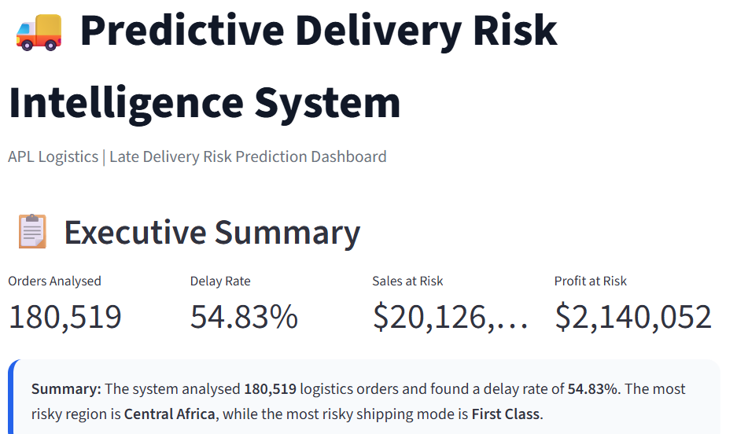
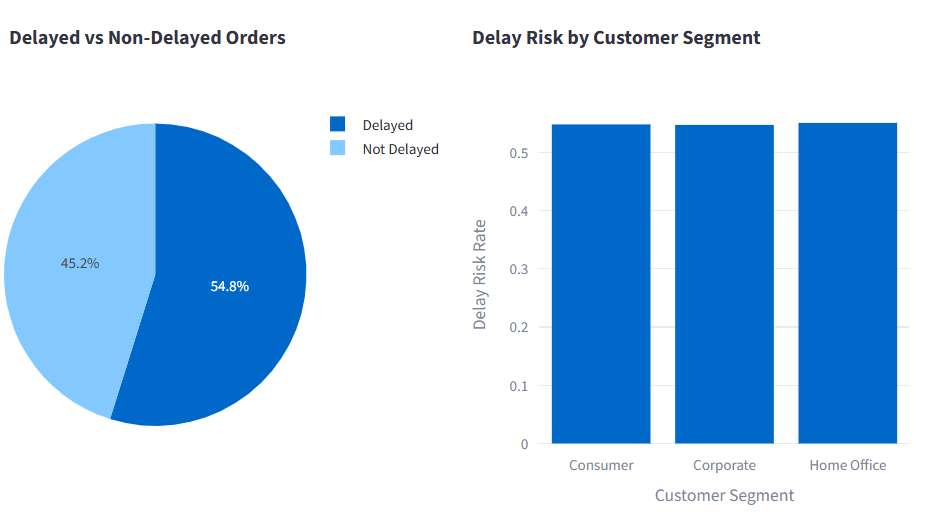
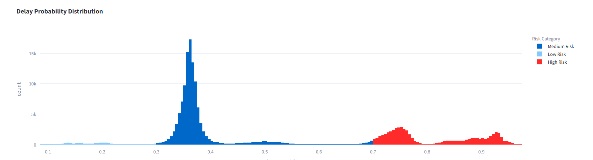

# 🚚 Predictive Delivery Risk Intelligence System

A Machine Learning-powered logistics analytics platform that predicts shipment delay risk before dispatch and enables operations teams to proactively manage high-risk deliveries.

---

## 🌐 Live Demo

[**Live Application:**](https://delivery-risk-prediction-5.onrender.com/)

---

*Research Paper Link* :
[Research_Paper](https://www.overleaf.com/read/zszhntgqtprg#b2868c)

---


LinkedIn:
[LinkedIn](https://www.linkedin.com/in/hitesh-kandpal-292644286/)


---

## 📌 Project Overview

Late deliveries create operational inefficiencies, customer dissatisfaction, SLA violations, and increased costs.

This project provides a predictive solution that helps logistics teams identify risky shipments before dispatch and prioritize operational actions using machine learning.

The system analyzes shipping, order, product, and customer information to generate delay probabilities and risk categories for proactive decision-making.

---

## 🎯 Business Objective

The primary objectives of this project are:

* Predict late delivery risk before shipment
* Identify high-risk orders requiring intervention
* Quantify sales and profit exposure
* Analyze risky markets, regions, and shipping modes
* Improve operational planning and customer communication

---

## 📊 Dataset

**Dataset Source:**

https://www.kaggle.com/datasets/shashwatwork/dataco-smart-supply-chain-for-big-data-analysis

### Dataset Includes

* Order Information
* Customer Information
* Shipping Details
* Product Data
* Market & Region Information
* Sales & Profit Metrics
* Delivery Status

---

## 🛠️ Technology Stack

### Programming Language

* Python

### Data Analysis

* Pandas
* NumPy

### Machine Learning

* Scikit-Learn
* Random Forest Classifier

### Data Visualization

* Plotly
* Matplotlib

### Dashboard

* Streamlit

---

## 🤖 Machine Learning Pipeline

### Data Preprocessing

* Missing value handling
* Feature engineering
* Categorical encoding
* Data cleaning

### Model Development

* Random Forest Classifier
* Automated preprocessing pipeline
* Risk probability generation

### Output

* Delay Probability
* Risk Category
* Operational Recommendation

---

## 📈 Dashboard Features

### Executive Summary

Provides a high-level business overview including:

* Orders Analysed
* Delay Rate
* Sales at Risk
* Profit at Risk
* Strategic Recommendations

### Risk Overview

Provides visual analysis of:

* Delayed vs Non-Delayed Orders
* Customer Segment Risk Distribution
* Delay Risk Insights

### Delay Risk Analysis

Analyzes:

* Shipping Performance
* Sales Impact
* Delay Patterns
* Delivery Risk Drivers

### Operations Action Panel

Provides:

* High-Risk Order Queue
* Risk Categorization
* Operational Recommendations
* Risk Distribution Analysis

### Model Performance

Includes:

* Accuracy
* Precision
* Recall
* F1 Score
* Confusion Matrix
* ROC Curve

---

## 📸 Dashboard Screenshots

### Executive Summary




### Risk Overview




### Operations Action Panel



---

## 📁 Project Structure

```text
Delivery-Risk-Prediction/
│
├── dashboard/
│   ├── app.py
│   └── style.css
│
├── models/
│   ├── delivery_risk_model.pkl
│   └── model_comparison.csv
│
├── reports/
│   └── figures/
│
├── screenshots/
│   ├── executive_summary.png
│   ├── risk_overview.png
│   └── operations_action_panel.png
│
├── src/
│   ├── data_loader.py
│   ├── preprocessing.py
│   ├── feature_engineering.py
│   ├── model_training.py
│   ├── predictor.py
│   ├── evaluator.py
│   ├── risk_scoring.py
│   ├── visualizer.py
│   └── kpi_calculator.py
│
├── main.py
├── requirements.txt
└── README.md
```

---

## 📊 Key Business Insights

* More than half of shipments exhibit delay risk.
* Certain regions consistently demonstrate higher delivery risk.
* Risk scoring enables proactive shipment prioritization.
* Early intervention can reduce operational disruptions and customer dissatisfaction.
* Data-driven logistics planning improves supply chain efficiency.

---

## 🚀 Future Improvements

* XGBoost Integration
* LightGBM Integration
* Hyperparameter Optimization
* Real-Time Prediction APIs
* Automated Alert System
* Cloud Monitoring Dashboard

---

## 👨‍💻 Author

### Hitesh Kandpal

B.Tech Computer Science Engineering

Machine Learning | Data Analytics | Predictive Modeling


